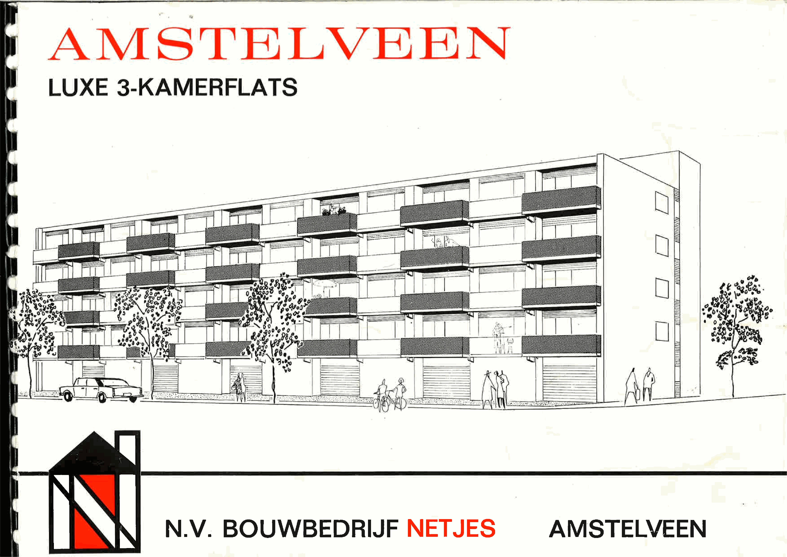
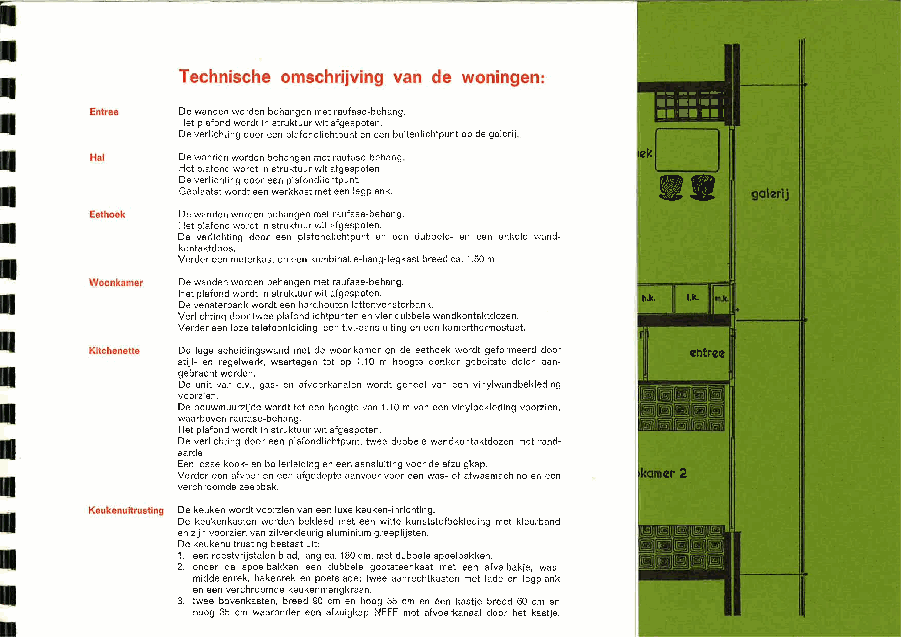
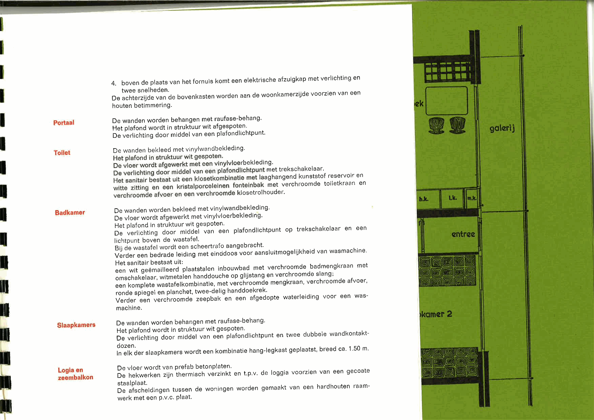
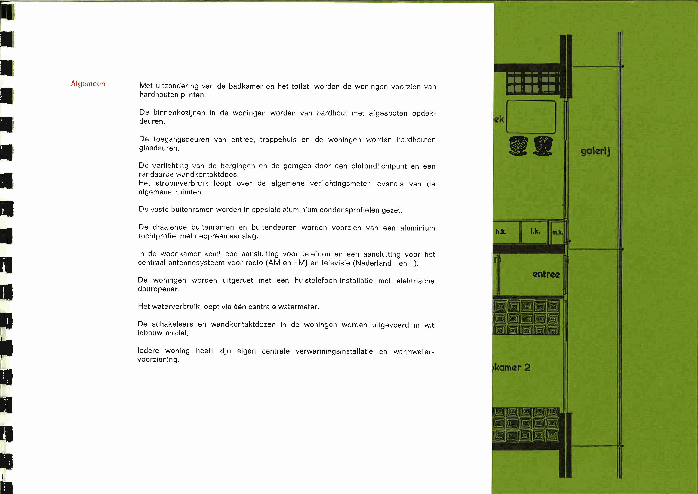
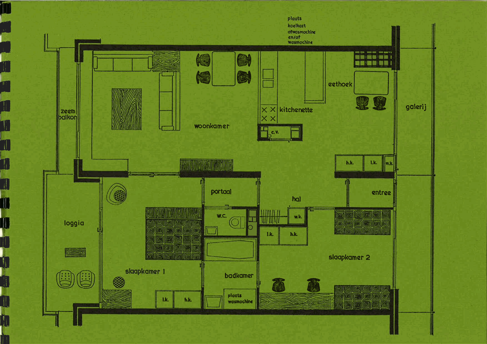
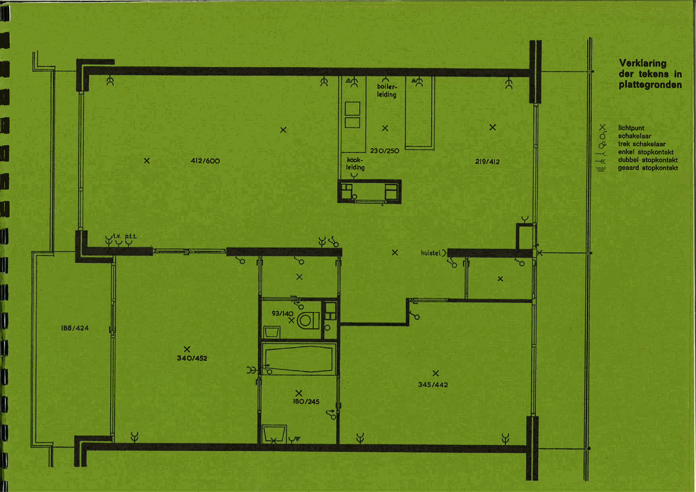
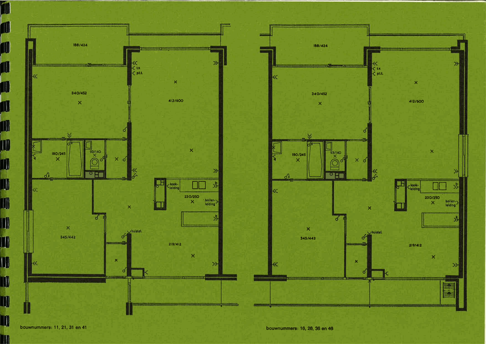
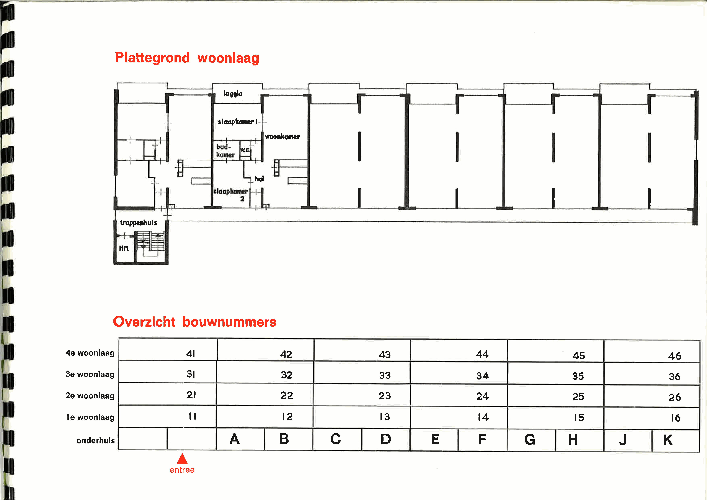
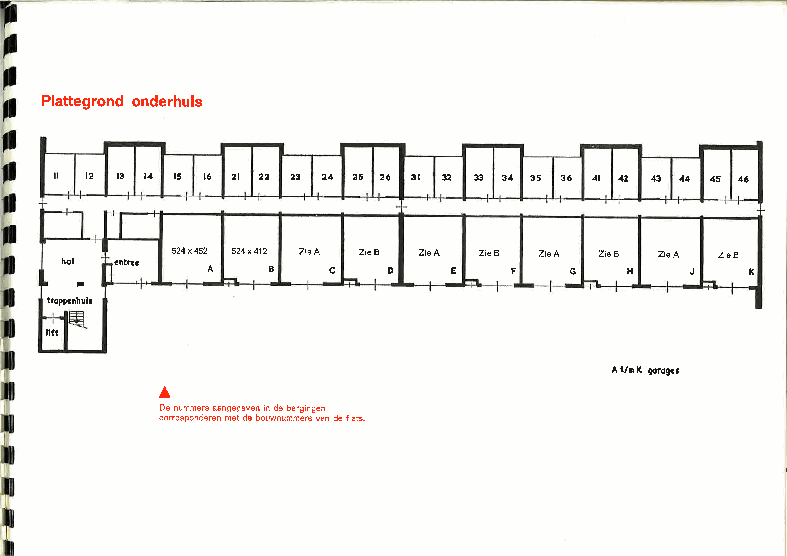

# Brochure + Plattegronden

> **English Summary:** Original sales brochure for the luxury 3-room apartments at Matterhorn 2-48, Amstelveen, built by N.V. Bouwbedrijf Netjes. Contains detailed technical specifications of the building (yellow brick facade, reinforced concrete floors, hardwood exterior frames), apartment interior finishes (raufase wallpaper, vinyl bathroom/kitchen surfaces, hardwood plinths), kitchen equipment (stainless steel countertop 180cm, double sink, NEFF extractor), bathroom fixtures (built-in bathtub, washbasin, mixer taps), and central heating specifications (gas-fired, reaching 22°C in living areas at -10°C outside). Includes floor plans showing the 2-bedroom apartment layout (living room, kitchenette, dining area, 2 bedrooms, bathroom, separate WC, loggia, gallery access) and the ground floor plan with 24 storage units and 10 garages (A-K). Building has 4 residential floors with 6 apartments each (24 total), elevator, and central antenna system.

> **Year:** N/A (original construction brochure)

## Page 1

**AMSTELVEEN**

**LUXE 3-KAMERFLATS**

**N.V. BOUWBEDRIJF NETJES**
AMSTELVEEN

**Afbeelding:** Omslagpagina met een architectonische lijntekening van een appartementencomplex in perspectief. Het gebouw bestaat uit ongeveer 5 woonlagen boven een plint/garage- of bergingslaag. Over de volledige voorgevel zijn meerdere balkons zichtbaar in horizontale rijen. Aan de rechterzijde is een kopgevel zichtbaar met enkele kleine vierkante ramen. Op straatniveau zijn meerdere brede openingen/garagedeuren getekend. Voor het gebouw staan bomen langs de straat.

<!-- CONFIDENCE: 97/100 -->

---

## Page 2

### Algemene technische gegevens van het gebouw

- De gevels worden gemetseld in een gele gevelsteen.
- De binnenmuren van hoofdentree, hal en trappehuis worden eveneens in gele gevelsteen gemetseld.
- De verdiepingsvloeren en bouwmuren worden van gewapend beton.
- De vloeren van hoofdentree, hal en de bordessen in het trappehuis worden belegd met dubbelhardgebakken tegels 10 x 10 cm in de kleur rood-zwart gevlamd.
- Het plafond van de hoofdentree en de hal krijgt een fraaie hardhouten betimmering.
- De trappen worden betontrappen in <!-- OCR-UNCERTAIN: ocriet-uitvoering -->.
- De buitenkozijnen worden vervaardigd van hardhout, dark red Meranti.
- De garagedeuren worden stalen kanteldeuren.
- De woningen worden uitgerust met een huistelefoon met een mikrofoon in de hoofdentree en een elektrische deuropener.
- In de hoofdentree komt voor iedere woning een postkastje en in de hal een boodschappenkast.
  Iedere woning krijgt een aparte berging in de onderbouw.
- Om voldoende waterdruk te waarborgen, wordt in het onderhuis een doorstroom drukverhogingsinstallatie geplaatst.
- De verlichting van de hoofdentree, hal, trappehuis en overige gemeenschappelijke ruimten wordt automatisch geregeld.
- Het hang- en sluitwerk wordt van een solide witmetalen uitvoering.
- Het gebouw wordt voorzien van een liftinstallatie en een centraal antennesysteem voor de ontvangst van radio (AM en FM) en T.V. (Nederland I en II).
- Iedere woning wordt voorzien van een eigen automatische, aardgas gestookte centrale verwarmingsinstallatie met warmwatervoorziening,
  welke geplaatst wordt in de c.v. kast.
  Vanuit de gaswandketel in de c.v. kast wordt warm water geleverd voor de keuken, badkamer en wastafel.
- De capaciteit is zodanig dat bij een buitentemperatuur van — 10° C. en een windsnelheid van 5 m/sec. en een gelijktijdige verwarming van alle vertrekken, de volgende temperaturen worden bereikt:

| Vertrek | Temperatuur | Vertrek | Temperatuur |
|---|---:|---|---:|
| hal | 22° C | slaapkamer 2 | 18° C |
| woonkamer | 22° C | slaapkamer 1 | 22° C |
| kitchenette | 22° C | badkamer | 22° C |
| eethoek | 22° C |  |  |

- Er komen 10 garageboxen in de onderbouw.
- De balkonzijde van de gevel is voorzien van een zogenaamd „zeem balkon", zodat een ieder desgewenst de eigen ramen kan schoonhouden.

<!-- CONFIDENCE: 97/100 -->

---

## Page 3

### Technische omschrijving van de woningen

**Entree**
De wanden worden behangen met raufase-behang.
Het plafond wordt in struktuur wit afgespoten.
De verlichting door een plafondlichtpunt en een buitenlichtpunt op de galerij.

**Hal**
De wanden worden behangen met raufase-behang.
Het plafond wordt in struktuur wit afgespoten.
De verlichting door een plafondlichtpunt.
Geplaatst wordt een werkkast met een legplank.

**Eethoek**
De wanden worden behangen met raufase-behang.
<!-- OCR-UNCERTAIN: Het plafond wordt in struktuur wit afgespoten. -->
De verlichting door een plafondlichtpunt en een dubbele- en een enkele wand-
kontaktdoos.
Verder een meterkast en een kombinatie-hang-legkast breed ca. 1.50 m.

**Woonkamer**
De wanden worden behangen met raufase-behang.
Het plafond wordt in struktuur wit afgespoten.
De vensterbank wordt een hardhouten lattenvensterbank.
Verlichting door twee plafondlichtpunten en vier dubbele wandkontaktdozen.
Verder een loze telefoonleiding, een t.v.-aansluiting en een kamerthermostaat.

**Kitchenette**
De lage scheidingswand met de woonkamer en de eethoek wordt geformeerd door
stijl- en regelwerk, waartegen tot op 1.10 m hoogte donker gebeitste delen aan-
gebracht worden.
De unit van c.v., gas- en afvoerkanalen wordt geheel van een vinylwandbekleding
voorzien.
De bouwmuurzijde wordt tot een hoogte van 1.10 m van een vinylbekleding voorzien,
waarboven raufase-behang.
Het plafond wordt in struktuur wit afgespoten.
De verlichting door een plafondlichtpunt, twee dubbele wandkontaktdozen met rand-
aarde.
Een losse kook- en boilerleiding en een aansluiting voor de afzuigkap.
Verder een afvoer en een afgedopte aanvoer voor een was- of afwasmachine en een
verchroomde zeepbak.

**Keukenuitrusting**
De keuken wordt voorzien van een luxe keuken-inrichting.
De keukenkasten worden bekleed met een witte kunststofbekleding met kleurband
en zijn voorzien van zilverkleurig aluminium grijplijsten.
De keukenuitrusting bestaat uit:
1. een roestvrijstalen blad, lang ca. 180 cm, met dubbele spoelbakken.
2. onder de spoelbakken een dubbele gootsteenkast met een afvalbakje, was-
middelenrek, hakenrek en poetslade; twee aanrechtkasten met lade en legplank
en een verchroomde keukenmengkraan.
3. twee bovenkasten, breed 90 cm en hoog 35 cm en één kastje breed 60 cm en
hoog 35 cm waaronder een afzuigkap NEFF met afvoerkanaal door het kastje.

<!-- CONFIDENCE: 93/100 -->

---

## Page 4

4. boven de plaats van het fornuis komt een elektrische afzuigkap met verlichting en
twee snelheden.
De achterzijde van de bovenkasten worden aan de woonkamerzijde voorzien van een
houten betimmering.

**Portaal**
De wanden worden behangen met raufase-behang.
Het plafond wordt in struktuur wit afgespoten.
De verlichting door middel van een plafondlichtpunt.

**Toilet**
De wanden bekleed met vinylwandbekleding.
Het plafond in struktuur wit gespoten.
De vloer wordt afgewerkt met een vinylvloerbekleding.
De verlichting door middel van een plafondlichtpunt met trekschakelaar.
Het sanitair bestaat uit een closetkombinatie met laaghangend kunststof reservoir en
witte zitting en een kristalporceleinen fonteintbak met verchroomde toiletkraan en
verchroomde afvoer en een verchroomde closetrolhouder.

**Badkamer**
De wanden worden bekleed met vinylwandbekleding.
De vloer wordt afgewerkt met vinylvloerbekleding.
Het plafond in struktuur wit gespoten.
De verlichting door middel van een plafondlichtpunt op trekschakelaar en een
lichtpunt boven de wastafel.
Bij de wastafel wordt een scheertrafo aangebracht.
Verder een bedrade leiding met einddoos voor aansluitmogelijkheid van wasmachine.
Het sanitair bestaat uit:
een wit geëmailleerd plaatstalen inbouwbad met verchroomde badmengkraan met
omschakelaar, witmetalen handdouche op glijstang en verchroomde slang;
een komplete wastafelkombinatie, met verchroomde mengkraan, verchroomde afvoer,
ronde spiegel en planchet, twee-delig handdoekrek.
Verder een verchroomde zeepbak en een afgedopte waterleiding voor een was-
machine.

**Slaapkamers**
De wanden worden behangen met raufase-behang.
Het plafond wordt in struktuur wit gespoten.
De verlichting door middel van een plafondlichtpunt en twee dubbele wandkontakt-
dozen.
In elk der slaapkamers wordt een kombinatie hang-legkast geplaatst, breed ca. 1.50 m.

**<!-- OCR-UNCERTAIN: Logia en zeembalkon -->**
De vloer wordt van prefab betonplaten.
De hekwerken zijn thermisch verzinkt en t.p.v. de loggia voorzien van een gecoate
staalplaat.
De afscheidingen tussen de woningen worden gemaakt van een hardhouten raam-
werk met een p.v.c. plaat.

<!-- CONFIDENCE: 89/100 -->

---

## Page 5

### Algemeen

Met uitzondering van de badkamer en het toilet, worden de woningen voorzien van
hardhouten plinten.

De binnenkozijnen in de woningen worden van hardhout met afgespoten opdek-
deuren.

De toegangsdeuren van entree, trappehuis en de woningen worden hardhouten
glasdeuren.

De verlichting van de bergingen en de garages door een plafondlichtpunt en een
randaarde wandkontaktdoos.
Het stroomverbruik loopt over de algemene verlichtingsmeter, evenals van de
algemene ruimten.

De vaste buitenramen worden in speciale aluminium condensprofielen gezet.

De draaiende buitenramen en buitendeuren worden voorzien van een aluminium
tochtprofiel met neopreen aanslag.

In de woonkamer komt een aansluiting voor telefoon en een aansluiting voor het
centraal antennesysteem voor radio (AM en FM) en televisie (Nederland I en II).

De woningen worden uitgerust met een huistelefoon-installatie met elektrische
deuropener.

Het waterverbruik loopt via één centrale watermeter.

De schakelaars en wandkontaktdozen in de woningen worden uitgevoerd in wit
inbouw model.

Iedere woning heeft zijn eigen centrale verwarmingsinstallatie en warmwater-
voorziening,

<!-- CONFIDENCE: 94/100 -->

---

## Page 6

### Plattegrond appartement (volledig overzicht)

**Ruimte-indeling:**

- zeem balkon
- woonkamer
- kitchenette (met plaats koelkast, afwasmachine en/of wasmachine)
- c.v.
- eethoek
- galerij
- portaal
- w.c.
- hal
- w.k. / l.k. / h.k. / m.k. (kastruimtes)
- entree
- loggia
- slaapkamer 1 (met l.k., h.k.)
- badkamer (met plaats wasmachine)
- slaapkamer 2 (met h.k., l.k., m.k.)

**Beschrijving plattegrond:**
Plattegrond van een 2-slaapkamer appartement. Toegang aan de rechterzijde via de galerij. Vanuit de galerij kom je in de entree, die aansluit op een hal. Aan de hal en entree liggen meerdere kastruimtes (h.k., l.k., m.k., w.k.). In het midden van de woning: apart w.c., badkamer met ligbad en wastafel, en een portaal. De woonkamer ligt aan de boven-/linkerzijde, groot opgezet met zithoek. Aansluitend de kitchenette en eethoek. Aan de linkerbovenzijde een smal zeem balkon. Aan de linkeronderzijde een grotere loggia. Slaapkamer 1 linksonder grenzend aan de loggia. Slaapkamer 2 rechtsonder.

<!-- CONFIDENCE: 90/100 -->

---

## Page 7

### Verklaring der tekens in plattegronden

- lichtpunt
- schakelaar
- trek schakelaar
- enkel stopkontakt
- dubbel stopkontakt
- geaard stopkontakt

### Plattegrond met afmetingen

| Ruimte | Afmeting (cm) |
|---|---|
| Woonkamer | 412 x 600 |
| Eethoek | 219 x 412 |
| Keuken/kitchenette | 230 x 250 |
| Slaapkamer 1 | 340 x 452 |
| Slaapkamer 2 | 345 x 442 |
| Badkamer | 180 x 245 |
| Toilet | 93 x 140 |
| Loggia/balkon | 188 x 424 |

Aansluitpunten: boilerleiding, kookleiding, p.t.t., <!-- OCR-UNCERTAIN: huistel. -->

<!-- CONFIDENCE: 86/100 -->

---

## Page 8

### Twee gespiegelde woningplattegronden

**Bouwnummers links:** 11, 21, 31 en 41
**Bouwnummers rechts:** 16, 26, 36 en 46

Twee vrijwel identieke woningplattegronden naast elkaar. Elke woning bevat: woonkamer, aparte keuken, twee slaapkamers, badkamer, apart toilet en een balkon/loggia. De plattegronden zijn gespiegeld.

**Afmetingen per ruimte:**

| Ruimte | Afmeting (cm) |
|---|---|
| Loggia/balkon | 186 x 424 |
| Slaapkamer 1 | 340 x 452 |
| Woonkamer | 412 x 600 |
| Badkamer | 180 x 245 |
| Toilet | 93 x 140 |
| Slaapkamer 2 | 345 x 442 |
| Keuken | 219 x 412 |
| Keukenblok | 230 x 250 |

Aansluitpunten: t.v., p.t.t., kookleiding, boilerleiding, huis tel.

<!-- OCR-UNCERTAIN: De bovenste buitenruimte met maat 186/424 lijkt een balkon of loggia -->

<!-- CONFIDENCE: 93/100 -->

---

## Page 9

### Plattegrond woonlaag

Schematische plattegrond van een woonlaag van het appartementenblok. Links de ontsluitingskern met **trappenhuis** en **lift**. Aan de onderzijde loopt een lange galerij langs de woningen. Zes naast elkaar gelegen woningvakken per woonlaag.

**Woningindeling (uitgewerkt voorbeeld):**
- loggia
- slaapkamer 1
- woonkamer
- badkamer
- wc
- hal
- slaapkamer 2

### Overzicht bouwnummers

| Verdieping | Bouwnummers |
|---|---|
| 4e woonlaag | 41, 42, 43, 44, 45, 46 |
| 3e woonlaag | 31, 32, 33, 34, 35, 36 |
| 2e woonlaag | 21, 22, 23, 24, 25, 26 |
| 1e woonlaag | 11, 12, 13, 14, 15, 16 |
| onderhuis | A, B, C, D, E, F, G, H, J, K |

entree ↓

<!-- CONFIDENCE: 96/100 -->

---

## Page 10

### Plattegrond onderhuis

**Bergingen** (bovenrij, nummers corresponderen met bouwnummers flats):
11, 12, 13, 14, 15, 16, 21, 22, 23, 24, 25, 26, 31, 32, 33, 34, 35, 36, 41, 42, 43, 44, 45, 46

**Gemeenschappelijke ruimten** (linkerzijde):
- hal
- entree
- trappenhuis
- lift

**Garages** (onderrij, A t/m K):

| Garage | Afmeting (cm) | Type |
|---|---|---|
| A | 524 x 452 | Type A |
| B | 524 x 412 | Type B |
| C | Zie A | Type A |
| D | Zie B | Type B |
| E | Zie A | Type A |
| F | Zie B | Type B |
| G | Zie A | Type A |
| H | Zie B | Type B |
| J | Zie A | Type A |
| K | Zie B | Type B |

De nummers aangegeven in de bergingen corresponderen met de bouwnummers van de flats.

<!-- CONFIDENCE: 98/100 -->
